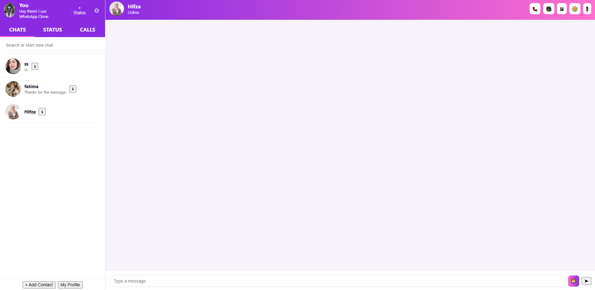
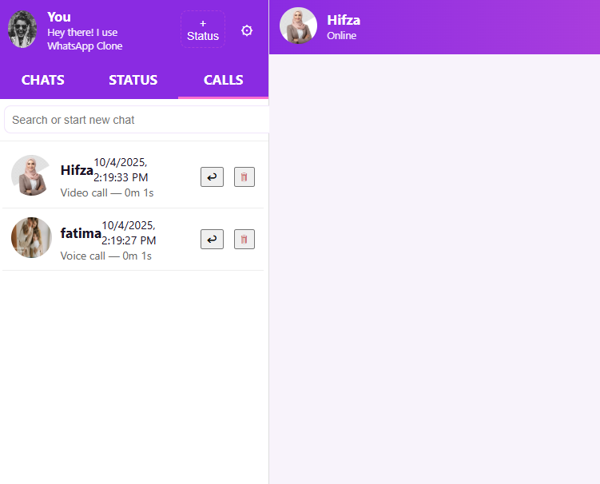
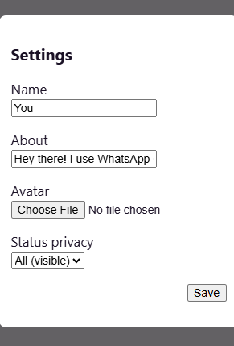
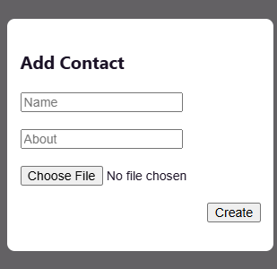

Real-Time Chat App

# 📱 Real-Time Chat App (HTML, CSS, JavaScript)

A fully functional **Real-Time Chat App** built using **pure HTML, CSS, and JavaScript**.  
This project is for learning purposes and demonstrates **real-time chat UI, contacts, messages, status, calls, stickers, and more**.

---

## 🚀 Features

- ✅ **Login / Profile Setup**
- ✅ **Chats Section** (Send / Receive messages)
- ✅ **Reply & Forward Messages**
- ✅ **Stickers Support**
- ✅ **Status / Story Feature**
- ✅ **Calls Section**
- ✅ **Wallpaper Customization**
- ✅ **Search Contacts & Messages**
- ✅ **Auto-Reply Chatbot** (e.g., "hi", "thanks", "aslamoalikum")
- ✅ **Settings** (Change name, about, profile picture)

---

## 🛠️ Technologies Used

- **HTML5** → Structure
- **CSS3** → Styling (WhatsApp-like UI)
- **JavaScript (ES6)** → Logic & Functionality
- **LocalStorage** → Save profile and chat data locally

---

## 📂 Project Structure

├── index.html # Main
├── style.css
└── images
└── README.md # Project documentation

## ⚡ Auto-Reply Examples

| User Message         | Auto Reply            |
| -------------------- | --------------------- |
| hi / hello / hey     | Hello 👋              |
| how are you          | I'm fine, thanks! 😊  |
| what's up            | All good here!        |
| bye / goodbye        | Goodbye! 👋           |
| thanks               | You're welcome!       |
| aslamoalikum / salam | Wa Alaikum Assalam 🤲 |

---

## 🎨 Screenshots

### 🟢 Chats

### 🟣 Status

### 🔵 Calls

### ⚙️ Settings

### ⚙️ Settings

